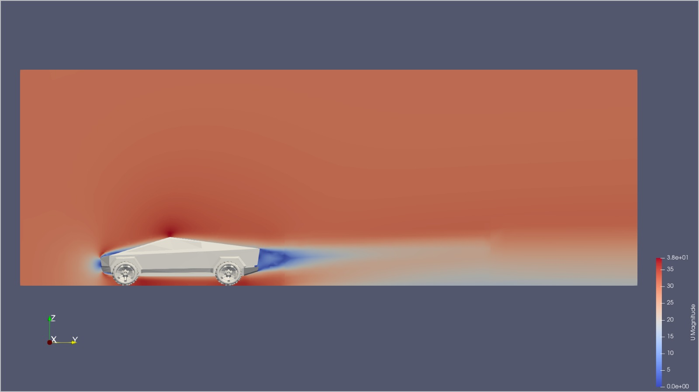

# cybertruckAerodynamics

This is the analysis of the Tesla Cybertruck standard configuration aerodynamic properties on OpenFOAM 12 made by POLIMI students. The analysis will also include modified configurations of the vehicle.
